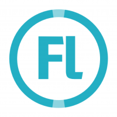

### ***YOOOOOOOOOOOOOOOOOOO*** 
***Hola soy Saimonelkin (aka Simon Ars)***

I'm making my own game on <a href="https://haxe.org">Haxe </a>

## Also use Haxelibs such as:

- <a href="https://lime.openfl.org">**Lime** </a>

- <a href="https://openfl.org">**Openfl** </a>

- <a href="https://haxeflixel.com">**Flixel** </a>

## My own projects:

- **Story of Dawn (aka soda)**, not on github yet :>
  - My first and main project! You can say it's just a Friday night Funkin' mod, so what? I try to get away from it and go in my own direction, yes, gameplay is the same, but plot, mechanics, approach to game... I'll try to make candy out of it and make it the best project of my life.

- <a href="https://github.com/SimonArs/FakeMax">**MAX (aka Fake Max)**</a>
  - Just a funny project made purely for fun during the day. It's a sensitive topic for Russian residents (that's for me too...)

## My socials:
Do you want to follow my projects?

Join to my <a href="https://t.me/simonarsoff">Telegram channel </a>

And subscribe to my <a href="https://www.youtube.com/@SimonArs">YouTube channel </a>

If you want to donate to me for the development, then here is my <a href="https://new.donatepay.ru/@SimonArs">DonatePay!</a>

## Well...
Thanks for reading this shit! I'm really pleased. Have a nice day and night! ;D
